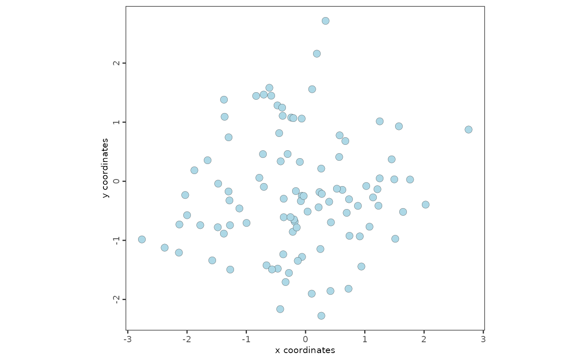

# Introduction to GiottoVisuals

## Description of the module GiottoVisuals

GiottoVisuals contains the main plotting functions of Giotto Suite.

For full examples of the usage of Giotto visualizations visit
<http://giottosuite.com>

## Script Organization by Prefixes:

aux\_ - auxiliary and meta functionality - aux_output.R - plot output
handling - aux_save.R - plot saving - aux_defaults.R - set plotting
defaults - aux_visuals.R - general auxiliary plotting functions

plot\_ - general plotting functions organized by type of plot -
plot_scatter.R - scatter plots - plot_violin.R - violin plots -
plot_heatmap.R - heatmaps - plot_dendrogram.R - dendrograms

vis\_ - specific plotting functions organized by topic - vis_hvf.R -
highly variable features plots - vis_pc.R - principle components plots -
vis_spatial.R - vis_spatial_in_situ.R

gg\_ - ggplot2 related - gg_info_layers.R - modular internals for
plotting the different layers of information

Other: - color_palettes.R - color palettes and factory functions

Package: - package_imports.R - all imports - globals.R - global
variables - dd.R - dummy documentation for inheriting - zzz.R - onloads

## Spatial plots

Load the package

``` r
library(GiottoVisuals)
```

Create a small Giotto object

``` r
expression_matrix <- matrix(rnorm(1000), nrow = 10)
colnames(expression_matrix) <- paste0("cell_", 1:100)
rownames(expression_matrix) <- paste0("gene_", 1:10)

spatial_locations <- data.frame(
    cell_ID = paste0("cell_", 1:100),
    sdimx = rnorm(100),
    sdimy = rnorm(100)
)

giotto_object <- GiottoClass::createGiottoObject(
    expression = expression_matrix,
    spatial_locs = spatial_locations
)
```

    ## checking default envname 'giotto_env'

    ## a system default python environment was found

    ## Using python path:
    ##  "/usr/bin/python3"

    ## Warning: Some of Giotto's expected python module(s) were not found:
    ## pandas, igraph, leidenalg, community, networkx, sklearn
    ## (This is fine if python-based functions are not needed)
    ## 
    ## ** Python path used: "/usr/bin/python3"

Plot the spatial locations

``` r
spatPlot2D(giotto_object)
```



## Session Info

``` r
sessionInfo()
```

    ## R version 4.5.2 (2025-10-31)
    ## Platform: x86_64-pc-linux-gnu
    ## Running under: Ubuntu 24.04.3 LTS
    ## 
    ## Matrix products: default
    ## BLAS:   /usr/lib/x86_64-linux-gnu/openblas-pthread/libblas.so.3 
    ## LAPACK: /usr/lib/x86_64-linux-gnu/openblas-pthread/libopenblasp-r0.3.26.so;  LAPACK version 3.12.0
    ## 
    ## locale:
    ##  [1] LC_CTYPE=C.UTF-8       LC_NUMERIC=C           LC_TIME=C.UTF-8       
    ##  [4] LC_COLLATE=C.UTF-8     LC_MONETARY=C.UTF-8    LC_MESSAGES=C.UTF-8   
    ##  [7] LC_PAPER=C.UTF-8       LC_NAME=C              LC_ADDRESS=C          
    ## [10] LC_TELEPHONE=C         LC_MEASUREMENT=C.UTF-8 LC_IDENTIFICATION=C   
    ## 
    ## time zone: UTC
    ## tzcode source: system (glibc)
    ## 
    ## attached base packages:
    ## [1] stats     graphics  grDevices utils     datasets  methods   base     
    ## 
    ## other attached packages:
    ## [1] GiottoVisuals_0.2.14
    ## 
    ## loaded via a namespace (and not attached):
    ##  [1] rappdirs_0.3.3     tidyr_1.3.1        plotly_4.11.0      sass_0.4.10       
    ##  [5] generics_0.1.4     gtools_3.9.5       lattice_0.22-7     digest_0.6.39     
    ##  [9] magrittr_2.0.4     evaluate_1.0.5     grid_4.5.2         RColorBrewer_1.1-3
    ## [13] fastmap_1.2.0      jsonlite_2.0.0     Matrix_1.7-4       ggrepel_0.9.6     
    ## [17] backports_1.5.0    scattermore_1.2    httr_1.4.7         purrr_1.2.0       
    ## [21] viridisLite_0.4.2  scales_1.4.0       lazyeval_0.2.2     codetools_0.2-20  
    ## [25] textshaping_1.0.4  jquerylib_0.1.4    cli_3.6.5          rlang_1.1.6       
    ## [29] cowplot_1.2.0      withr_3.0.2        cachem_1.1.0       yaml_2.3.10       
    ## [33] colorRamp2_0.1.0   parallel_4.5.2     tools_4.5.2        GiottoUtils_0.2.5 
    ## [37] checkmate_2.3.3    dplyr_1.1.4        colorspace_2.1-2   ggplot2_4.0.1     
    ## [41] reticulate_1.44.1  png_0.1-8          vctrs_0.6.5        R6_2.6.1          
    ## [45] lifecycle_1.0.4    fs_1.6.6           htmlwidgets_1.6.4  ragg_1.5.0        
    ## [49] pkgconfig_2.0.3    desc_1.4.3         pkgdown_2.2.0      terra_1.8-80      
    ## [53] bslib_0.9.0        pillar_1.11.1      gtable_0.3.6       data.table_1.17.8 
    ## [57] glue_1.8.0         Rcpp_1.1.0         systemfonts_1.3.1  xfun_0.54         
    ## [61] tibble_3.3.0       tidyselect_1.2.1   knitr_1.50         farver_2.1.2      
    ## [65] GiottoClass_0.4.10 htmltools_0.5.8.1  igraph_2.2.1       labeling_0.4.3    
    ## [69] rmarkdown_2.30     compiler_4.5.2     S7_0.2.1
